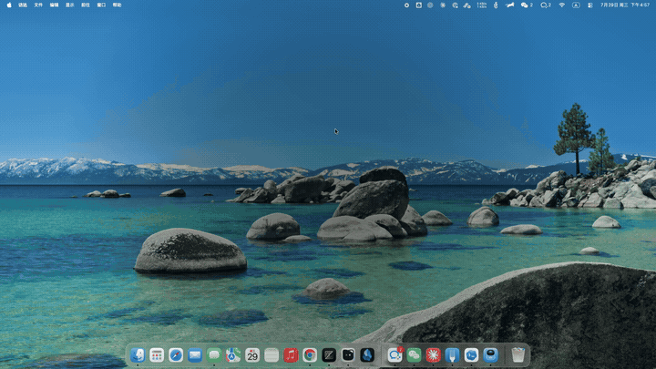

# gong（锣）

I'm outta here!

## 安装

```bash
brew install xwvike/tap/gong
gong on
```

默认启用两条定时：#1 12:00、#2 18:00，周一到周五。


```bash
gong set            # 进入定时器管理
gong ls             # 列出现有定时
gong themes         # 列出可用主题
gong vis <theme>    # 预览一个主题
gong stop           # 掐掉正在播的浮层
gong off            # 关掉 gong，但保留配置和程序
```

## 主题

### default


### tunnel



### 自定义主题

一个目录就是一个主题（`index.html` + `theme.toml`），放进
`~/.config/gong/themes/<name>/` 即可，gong 启动会自动扫描。主题同名会覆盖。

#### HTML接受

**一、两个 class，挂在 `<html>` 上**

| class | 什么时候加上 |
|---|---|
| `html.gong-live` | 浮层亮相，动画从这一刻开始 |
| `html.gong-fired` | `now` 走到了 `target` |

加上就不再移除。这是**给纯 CSS 主题用的时间通道**——CSS 没有时钟，拿不到下面那个
`now`，只能靠这两个 class 知道「开始了」和「到点了」。只用它俩就能写出一行 JS
都没有的主题。

**二、一个 `window.gong` 对象**，在你的脚本跑起来之前就注入好了

```js
window.gong = {
  apiVersion: 1,          // 接口版本，恒为 1
  target: 1753588800000,  // 目标时刻（Unix 毫秒），从头到尾不变
  now:    1753588795012,  // 现在几点，每次回调前刷新
  lead: 5,                // 提前几秒亮相
  force: false,           // true 表示这是 gong vis 预览
  revealed: false,        // ↓ 这两个是 v1 的历史包袱，新主题别读，见下
  fired: false,           //
  screens: 1,             // 一共几块屏
  screen: {index: 0, isMain: true, primary: true, w: 1512, h: 982, scale: 2},

  // 下面三个是空槽，你把函数填进去，外壳到时候会调
  onReveal: null,         // 亮相了，开始演
  onTick: null,           // 亮相后每 100ms 一次，参数就是当前的 now
  onFire: null,           // now 走到 target 了（迟到才加载的话立刻补发）

  done() {}               // 这个方向反过来，见下
};
```

填法就是赋值：

```js
const g = window.gong;
g.onReveal = () => { /* 开始演 */ };
g.onTick = now => { /* 用 now 的绝对差值推进，别数心跳次数 */ };
g.onFire = () => { /* now 走到 target 了 */ };
```

`onFire()` 保证早于第一条 `now >= target` 的 `onTick(now)`，所以这两种写法等价——
想在 `onTick` 里自己判断 `now >= target` 也行，不必非注册 `onFire`。

**外壳只给时间和屏幕，一个字的文案都不给。** 没有 message 之类的字段。定时的标签、
`theme.toml` 里的内容、一共有几条定时，一概不传。屏幕上出现什么字，全是主题自己
写死或算出来的——想要不同的提醒形式就写不同的主题，别在一个主题里按定时分支。

`fired` / `revealed` 是 v1 留下的状态字段，**新主题别读**：`fired` 就是
`now >= target`，`revealed` 就是「收到过 `onTick`」（心跳在亮相后才启动）。
状态从时间自己推，别依赖壳递过来。仓库里两个主题都不读它们。

#### HTML → 外壳

**只有一个：`g.done()`**，意思是「我演完了，可以退了」。

退场动画结束后再调。调完外壳立刻关掉所有屏幕上的浮层并退出进程。不调也行，
外壳会等到 timeout（`theme.toml` 里的 `duration` + 余量）自己退，只是会多挂一会儿。

多屏时每块屏各跑一份 HTML，`done()` 只有主屏那份算数，其余的会被安静忽略。
判断主屏用 `window.gong.screen.primary`，别假设 `screen.index === 0` 是主屏。

#### 三个坑

1. **动画挂在 `html.gong-live` 下面**，别按 `load` 起算。页面是提前加载好的，
   可能在亮相前几十秒就 load 完了。
2. **别用 `setTimeout` / `setInterval` / `requestAnimationFrame` 当时钟或退出闸门**，
   用 `onTick(now)` 的绝对时间和 `onFire`。rAF 可以画帧，但不能决定是否到点。
3. **常驻 CSS 动画别挂在带 `filter` 的元素上**，挂容器上。前者会把主线程压死，
   压死之后连 JS 定时器都不来了，主题永远喊不出 `done()`。

写完直接 `gong vis <theme>` 调试，预览和真实触发走的是完全同一条渲染路径。
主题里的 `console.log` 和未捕获异常都会打到 stderr。

完整的类型、单位、不变量和生命周期见 [Theme API v1](doc.md#theme-api-v1)。

## 卸载gong

```bash
gong uninstall
```

参数 `--purge` 会同时清除自定义主题目录 `~/.config/gong`。

**别直接 `brew uninstall gong`** —— formula 没有 uninstall hook，plist 会留在
`~/Library/LaunchAgents`，之后每天到点去拉一个不存在的二进制，而且是静默失败。
`gong uninstall` 会先清 plist、从 launchd 撤出，最后自动帮你跑 `brew uninstall`。
