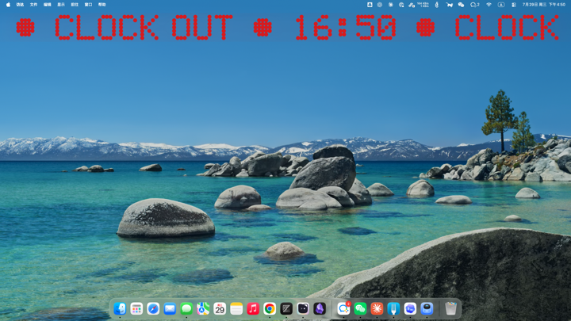
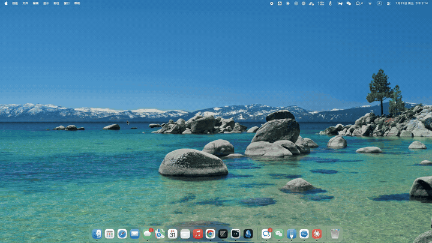

# gong

I'm outta here!

## 安装

```bash
brew install xwvike/tap/gong
gong on
```

默认启用两条随机主题定时：#1 12:00、#2 18:00，周一到周五。


```bash
gong on             # 启用 gong，让它提醒你该溜了！
gong set            # 进入定时器管理
gong ls             # 列出现有定时
gong themes         # 列出可用主题
gong vis <theme>    # 预览一个主题
gong stop           # 掐掉正在播的浮层
gong off            # 关掉 gong，但保留配置和程序
```

## 主题

每条定时可以固定使用一个主题，也可以选择“随机”或“顺序”。顺序模式按主题名排序轮换，
只按该定时选中的触发日推进，周末等未选日期不会跳号。

### led



### tunnel


### noise



## 卸载

```bash
gong uninstall
```

参数 `--purge` 会同时清除自定义主题目录 `~/.config/gong`。

**不要直接运行 `brew uninstall gong`**，否则 plist 会残留在
`~/Library/LaunchAgents`。
